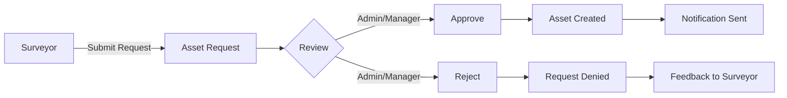

# 🏡 Real Estate Asset Management System

## 📋 Overview

**Real Estate Asset Management System** adalah aplikasi web berbasis Laravel 10 untuk pengelolaan aset tanah real estate dengan integrasi peta interaktif menggunakan Leaflet.js dan PostgreSQL dengan PostGIS. Sistem ini menerapkan role-based access control dengan alur persetujuan bertingkat dan manajemen dokumen yang komprehensif.

## 🚀 Key Features

### 🎯 **Core Features**
- **Interactive Map Integration** - Visualisasi aset dengan Leaflet.js & PostGIS
- **Role-Based Access Control** - 3 level akses (Admin, Manager, Surveyor)
- **Asset Request Workflow** - Sistem persetujuan bertingkat untuk surveyor
- **Document Management** - Upload, download, dan manajemen dokumen aset
- **Advanced Search & Filter** - Pencarian fleksibel dengan multiple criteria
- **Real-time Statistics** - Dashboard dengan charts menggunakan Chart.js
- **Responsive Design** - UI modern dengan Tailwind CSS

### 📊 **Advanced Features**
- **Geometry Management** - Drawing dan editing polygon area
- **Area Calculation** - Otomatis calculate luas dari geometry
- **Multi-format Export** - PDF, Excel export capabilities
- **Security Features** - File validation, secure downloads
- **Audit Trail** - Log aktivitas user
- **Real-time Notifications** - Status update notifications

## 🏗️ System Architecture

### 🗂️ **Technology Stack**

| Component | Technology |
|-----------|------------|
| **Backend Framework** | Laravel 10 |
| **Database** | PostgreSQL + PostGIS |
| **Authentication** | Laravel Breeze |
| **Frontend** | Blade Templates + Tailwind CSS |
| **Maps** | Leaflet.js + Leaflet.draw |
| **Charts** | Chart.js |
| **File Storage** | Laravel Storage (Private Disk) |
| **Real-time** | Laravel Events & Listeners |

### 🎨 **UI/UX Components**
- **Responsive Layout** - Mobile-first design
- **Interactive Charts** - Line, Bar, Pie, Doughnut charts
- **Map Controls** - Draw, edit, delete geometry tools
- **Form Validation** - Real-time client & server validation
- **File Management** - Drag & drop upload interface

## 👥 User Roles & Permissions

### 🔑 **Role Matrix**

| Feature | Admin | Manager | Surveyor | Public |
|---------|-------|---------|----------|--------|
| View Assets | ✅ All | ✅ All | ✅ All | ✅ Public Only |
| Create Assets | ✅ Direct | ✅ Direct | ✅ Request | ❌ |
| Edit Assets | ✅ Direct | ✅ Direct | ✅ Request | ❌ |
| Delete Assets | ✅ | ✅ | ❌ | ❌ |
| Manage Documents | ✅ | ✅ | ❌ | ❌ |
| Approve Requests | ✅ | ✅ | ❌ | ❌ |
| User Management | ✅ | ❌ | ❌ | ❌ |
| Statistics | ✅ | ✅ | ✅ | ❌ |

### 🎭 **Role Descriptions**

#### 👑 **Administrator**
- **Full System Access** - Complete CRUD operations
- **User Management** - Create, edit, delete users
- **Request Approval** - Approve/reject surveyor requests
- **Document Management** - Upload, download, manage all documents
- **System Statistics** - Access to all analytics and reports

#### 🏢 **Manager**  
- **Asset Management** - Direct CRUD for assets
- **Request Approval** - Approve/reject surveyor requests
- **Document Management** - Upload, download, manage documents
- **Team Analytics** - Access to asset and request statistics

#### 🗺️ **Surveyor**
- **Field Data Collection** - Create asset requests with map data
- **Request Management** - Submit, edit pending requests
- **Asset Viewing** - Read-only access to approved assets
- **Personal Dashboard** - Track own requests and statistics

#### 🌐 **Public Users**
- **Asset Browsing** - View available assets (non-sensitive)
- **Basic Search** - Filter by location, price range
- **Asset Details** - View property information and location

## 🔄 Business Process Flow

### 📋 **Asset Creation Process**



### 🔄 **Detailed Workflow**

#### 1️⃣ **Surveyor Workflow**
1. **Create Request** - Fill asset form with map polygon
2. **Upload Documents** - Attach supporting files (optional)
3. **Submit Request** - Send for approval
4. **Track Status** - Monitor request progress
5. **Receive Feedback** - Get approval/rejection notification

#### 2️⃣ **Admin/Manager Workflow**
1. **Review Requests** - Check pending submissions
2. **Validate Data** - Verify asset information and geography
3. **Make Decision** - Approve or reject with notes
4. **Asset Creation** - Approved data becomes live asset
5. **Notification** - Automatic status update to surveyor

#### 3️⃣ **Asset Lifecycle**
```
Draft → Pending → Approved → Active → [Updated/Sold/Rented]
```

## 🗃️ Database Schema

### 📊 **Main Tables**

#### **land_assets**
```sql
id                UUID PRIMARY KEY
code              VARCHAR(50) UNIQUE      -- Asset code (auto-generated)
name              VARCHAR(255)            -- Asset name
description       TEXT                    -- Detailed description
address           TEXT                    -- Full address
area_sqm          NUMERIC(10,2)          -- Area in square meters
value             NUMERIC(15,2)          -- Asset value in IDR
status            VARCHAR(50)            -- tersedia, disewakan, terjual, dalam_sengketa
geometry          GEOMETRY(Polygon,4326) -- Geographic coordinates
owner             VARCHAR(255)           -- Owner name
owner_contact     VARCHAR(255)           -- Owner contact info
created_by        UUID                   -- Creator user ID
updated_by        UUID                   -- Last updater user ID
created_at        TIMESTAMP
updated_at        TIMESTAMP
```

#### **asset_requests**
```sql
id              UUID PRIMARY KEY
type            VARCHAR(20)         -- 'create' or 'update'
asset_id        UUID               -- NULL for create, asset ID for update
proposed_data   JSONB              -- Complete asset data proposal
requested_by    UUID               -- Surveyor user ID
approved_by     UUID               -- Admin/Manager user ID
status          VARCHAR(20)        -- pending, approved, rejected
notes           TEXT               -- Admin feedback/notes
reviewed_at     TIMESTAMP          -- Decision timestamp
created_at      TIMESTAMP
updated_at      TIMESTAMP
```

#### **asset_documents**
```sql
id              UUID PRIMARY KEY
asset_id        UUID               -- Related asset
document_name   VARCHAR(255)       -- Display name
document_type   VARCHAR(100)       -- Certificate, Survey, etc.
file_path       VARCHAR(500)       -- Storage path
file_size       INTEGER            -- File size in bytes
mime_type       VARCHAR(100)       -- File MIME type
issue_date      DATE               -- Document issue date
expiry_date     DATE               -- Document expiry (optional)
created_at      TIMESTAMP
updated_at      TIMESTAMP
```

#### **users**
```sql
id              UUID PRIMARY KEY
name            VARCHAR(255)
email           VARCHAR(255) UNIQUE
role            VARCHAR(50)        -- admin, manager, surveyor
email_verified_at TIMESTAMP
password        VARCHAR(255)
created_at      TIMESTAMP
updated_at      TIMESTAMP
```

### 🔗 **Relationships**
- `land_assets.created_by` → `users.id`
- `land_assets.updated_by` → `users.id`
- `asset_requests.requested_by` → `users.id`
- `asset_requests.approved_by` → `users.id`
- `asset_requests.asset_id` → `land_assets.id` (for updates)
- `asset_documents.asset_id` → `land_assets.id`

## 🗺️ Map Integration

### 🎨 **Leaflet.js Features**
- **Base Maps** - OpenStreetMap integration
- **Drawing Tools** - Polygon creation and editing
- **Geometry Validation** - Ensure valid polygon shapes
- **Area Calculation** - Real-time area computation
- **Marker Clustering** - Performance optimization for many assets
- **Custom Popups** - Rich asset information display

### 📐 **PostGIS Integration**
- **Spatial Queries** - Geographic search and filtering
- **Area Calculations** - Server-side geometry processing
- **Coordinate Systems** - WGS84 (EPSG:4326) support
- **Polygon Validation** - Ensure geographic data integrity

## 📊 Statistics & Analytics

### 📈 **Dashboard Charts**
- **Monthly Asset Trends** - Line chart showing asset additions
- **Request Statistics** - Bar chart of monthly requests
- **Status Distribution** - Pie charts for asset/request status
- **Value Analytics** - Asset value trends over time
- **Performance Metrics** - User activity and system usage

### 🎯 **Key Metrics**
- Total assets in system
- Pending requests count
- Monthly growth rate
- User activity statistics
- Geographic distribution
- Asset value distribution

## 🔍 Search & Filtering

### 🔎 **Advanced Search Features**
- **Text Search** - Name, code, address, owner
- **Status Filter** - Available, rented, sold, disputed
- **Value Range** - Price-based filtering
- **Geographic Filter** - Location-based search
- **Date Range** - Creation/update date filtering
- **Combined Filters** - Multiple criteria support

### 🎨 **Search UI**
- **Flexible Input** - Single search box for multiple fields
- **Filter Categories** - Dropdown selections
- **Clear Function** - Reset all filters
- **Result Counter** - Show filtered results count
- **Map Synchronization** - Search results reflect on map

## 📁 Document Management

### 📄 **Supported Documents**
- **Certificates** - Property ownership documents
- **Survey Reports** - Land survey documentation
- **Legal Documents** - Contracts, agreements
- **Images** - Property photos, maps
- **Technical Drawings** - Architectural plans

### 🔒 **Security Features**
- **Private Storage** - Files not directly accessible
- **Access Control** - Role-based download permissions
- **File Validation** - Type and size restrictions
- **Secure Downloads** - Authenticated file serving
- **Audit Trail** - Track document access

## 🛠️ Installation & Setup

### ⚙️ **Prerequisites**
```bash
- PHP 8.1+
- Composer
- Node.js & NPM
- PostgreSQL 13+
- PostGIS Extension
```

### 📦 **Installation Steps**

1. **Clone Repository**
```bash
git clone https://github.com/yourusername/realestate-management.git
cd realestate-management
```

2. **Install Dependencies**
```bash
composer install
npm install
```

3. **Environment Configuration**
```bash
cp .env.example .env
php artisan key:generate
```

4. **Database Setup**
```bash
# Create PostgreSQL database with PostGIS
createdb realestate_db
psql -d realestate_db -c "CREATE EXTENSION postgis;"

# Update .env file
DB_CONNECTION=pgsql
DB_HOST=127.0.0.1
DB_PORT=5432
DB_DATABASE=realestate_db
DB_USERNAME=your_username
DB_PASSWORD=your_password
```

5. **Run Migrations**
```bash
php artisan migrate
php artisan db:seed
```

6. **Storage Setup**
```bash
php artisan storage:link
```

7. **Build Assets**
```bash
npm run build
```

8. **Start Development Server**
```bash
php artisan serve
```

### 🔑 **Default Credentials**
After seeding, use these credentials:

| Role | Email | Password |
|------|-------|----------|
| Admin | admin@example.com | password |
| Manager | manager@example.com | password |
| Surveyor | surveyor@example.com | password |

## 🌐 API Endpoints

### 🔐 **Authentication Routes**
```
POST   /login              # User login
POST   /logout             # User logout
GET    /register           # Registration form
POST   /register           # User registration
```

### 👑 **Admin Routes** (`/admin/*`)
```
GET    /admin/dashboard                 # Admin dashboard
GET    /admin/assets                    # Asset listing
POST   /admin/assets                    # Create asset
GET    /admin/assets/{id}/edit          # Edit asset form
PUT    /admin/assets/{id}               # Update asset
DELETE /admin/assets/{id}               # Delete asset
GET    /admin/asset-requests            # Request management
PATCH  /admin/asset-requests/{id}/approve # Approve request
PATCH  /admin/asset-requests/{id}/reject  # Reject request
GET    /admin/users                     # User management
```

### 🏢 **Manager Routes** (`/manager/*`)
```
GET    /manager/dashboard               # Manager dashboard
GET    /manager/assets                  # Asset management
GET    /manager/asset-requests          # Request review
PATCH  /manager/asset-requests/{id}/approve # Approve request
```

### 🗺️ **Surveyor Routes** (`/surveyor/*`)
```
GET    /surveyor/dashboard              # Surveyor dashboard
GET    /surveyor/assets                 # View assets (read-only)
GET    /surveyor/requests               # My requests
POST   /surveyor/requests               # Submit request
PUT    /surveyor/requests/{id}          # Update pending request
```

### 🌐 **Public Routes**
```
GET    /                                # Welcome page
GET    /assets                          # Public asset listing
GET    /assets/{id}                     # Asset detail view
```

## 📱 Usage Examples

### 🎯 **Common User Workflows**

#### **Surveyor: Creating Asset Request**
1. Navigate to `/surveyor/requests/create`
2. Fill in asset details (name, description, address, value)
3. Use map to draw property boundaries
4. Upload supporting documents (optional)
5. Submit request for approval
6. Track status in `/surveyor/requests`

#### **Admin: Approving Request**
1. Check pending requests in `/admin/asset-requests`
2. Review asset details and geography
3. Validate uploaded documents
4. Click "Approve" or "Reject" with notes
5. System automatically creates asset (if approved)
6. Surveyor receives notification

#### **Manager: Asset Management**
1. View asset overview in `/manager/dashboard`
2. Search/filter assets in `/manager/assets`
3. Click asset to view details and map
4. Edit asset information directly
5. Manage asset documents
6. Monitor request statistics

#### **Public: Browsing Assets**
1. Visit public assets page `/assets`
2. Use search to filter by criteria
3. View asset details and location
4. See property information (non-sensitive)

## 🔧 Configuration

### ⚙️ **Environment Variables**
```env
# Database
DB_CONNECTION=pgsql
DB_HOST=127.0.0.1
DB_PORT=5432
DB_DATABASE=realestate_db
DB_USERNAME=username
DB_PASSWORD=password

# File Storage
FILESYSTEM_DISK=local
PRIVATE_DISK_ROOT=storage/app/private

# Map Configuration
MAP_DEFAULT_LAT=-6.2088
MAP_DEFAULT_LNG=106.8456
MAP_DEFAULT_ZOOM=10

# File Upload Limits
MAX_FILE_SIZE=10240  # KB
ALLOWED_FILE_TYPES=pdf,doc,docx,jpg,png
```

### 🎨 **Customization Options**
- **Map Provider** - Change base map tiles
- **Color Scheme** - Modify Tailwind color palette
- **File Types** - Configure allowed document formats
- **User Roles** - Add custom permission levels
- **Notification** - Setup email/SMS alerts

## 🚀 Deployment

### 🌐 **Production Deployment**

#### **Server Requirements**
- **PHP 8.1+** with extensions: mbstring, xml, gd, postgis
- **PostgreSQL 13+** with PostGIS extension
- **Web Server** - Apache/Nginx
- **SSL Certificate** - HTTPS recommended
- **Storage** - Sufficient space for documents

#### **Environment Setup**
```bash
# Production environment
APP_ENV=production
APP_DEBUG=false
APP_URL=https://yourdomain.com

# Database optimization
DB_CONNECTION=pgsql
DB_OPTIMIZE=true

# Cache configuration
CACHE_DRIVER=redis
SESSION_DRIVER=redis
QUEUE_CONNECTION=redis

# Security
SESSION_SECURE_COOKIE=true
SANCTUM_STATEFUL_DOMAINS=yourdomain.com
```

#### **Performance Optimization**
```bash
# Optimize for production
php artisan config:cache
php artisan route:cache
php artisan view:cache
php artisan optimize

# Setup queue workers
php artisan queue:work --daemon
```

## 🤝 Contributing

### 📋 **Development Guidelines**
1. **Fork** the repository
2. **Create** feature branch (`git checkout -b feature/AmazingFeature`)
3. **Commit** changes (`git commit -m 'Add AmazingFeature'`)
4. **Push** to branch (`git push origin feature/AmazingFeature`)
5. **Open** Pull Request

### 🧪 **Testing**
```bash
# Run tests
php artisan test

# Run specific test suite
php artisan test --testsuite=Feature
php artisan test --testsuite=Unit

# Code coverage
php artisan test --coverage
```

### 📏 **Code Standards**
- Follow **PSR-12** coding standards
- Use **meaningful variable names**
- Add **comprehensive comments**
- Write **unit and feature tests**
- Update **documentation** for new features

## 🐛 Troubleshooting

### ❗ **Common Issues**

#### **PostGIS Extension Error**
```bash
# Install PostGIS extension
sudo apt-get install postgresql-contrib
sudo apt-get install postgis postgresql-postgis

# Enable in database
psql -d realestate_db -c "CREATE EXTENSION postgis;"
```

#### **File Upload Issues**
```bash
# Check PHP settings
upload_max_filesize = 10M
post_max_size = 10M
max_execution_time = 300

# Storage permissions
chmod -R 755 storage/
chmod -R 755 bootstrap/cache/
```

#### **Map Not Loading**
- Check internet connection (OpenStreetMap tiles)
- Verify JavaScript console for errors
- Ensure PostGIS data is valid
- Check coordinate system (EPSG:4326)

## 📞 Support

### 🆘 **Getting Help**
- **Documentation** - Check this README first
- **Issues** - Create GitHub issue for bugs
- **Discussions** - GitHub discussions for questions
- **Email** - contact@yourproject.com

### 📊 **System Status**
- **Database** - PostgreSQL with PostGIS
- **Storage** - Local file system
- **Maps** - Leaflet.js with OpenStreetMap
- **Security** - Laravel security features

## 📄 License

This project is licensed under the **MIT License** - see the [LICENSE](LICENSE) file for details.

## 🙏 Acknowledgments

- **Laravel Team** - Excellent PHP framework
- **PostGIS Community** - Spatial database capabilities  
- **Leaflet.js** - Interactive mapping library
- **Chart.js** - Beautiful chart visualizations
- **Tailwind CSS** - Utility-first CSS framework

---

**Real Estate Asset Management System** - Built with ❤️ using Laravel 10, PostgreSQL, and modern web technologies.

For more information, visit our [GitHub repository](https://github.com/yourusername/realestate-management).
- Interactive maps using Leaflet JS
- Activity logging

## Requirements

- PHP 8.1+
- PostgreSQL with PostGIS extension
- Composer
- Node.js and NPM

## Installation

1. Clone the repository:

```bash
git clone <repository-url>
cd RealEstate
```

2. Install PHP dependencies:

```bash
composer install
```

3. Install JavaScript dependencies:

```bash
npm install
```

4. Create a copy of the environment file:

```bash
cp .env.example .env
```

5. Generate application key:

```bash
php artisan key:generate
```

6. Configure your database in the `.env` file:

```
DB_CONNECTION=pgsql
DB_HOST=127.0.0.1
DB_PORT=5432
DB_DATABASE=realestate
DB_USERNAME=your_username
DB_PASSWORD=your_password
```

7. Run migrations and seed the database:

```bash
php artisan migrate
php artisan db:seed
```

8. Build assets:

```bash
npm run build
```

9. Start the development server:

```bash
php artisan serve
```

10. Visit `http://localhost:8000` in your browser.

## Test Users

The seeder creates the following test users:

| Email | Password | Role |
|-------|----------|------|
| admin@example.com | password | Administrator |
| manager@example.com | password | Manager |
| surveyor@example.com | password | Surveyor |
| user@example.com | password | Regular User |

## Directory Structure

- `app/Models`: Database models
- `app/Http/Controllers`: Controllers for each role
- `app/Http/Middleware`: Role-based middleware
- `resources/views`: Blade templates for views
- `database/migrations`: Database migrations
- `database/seeders`: Database seeders
- `routes/web.php`: Web routes

## Role-Based Access

- **Administrator**: Full access to all features
- **Manager**: Can manage assets and approve requests
- **Surveyor**: Can view assets and submit requests for approval
- **User**: Can only view public information

## License

This project is open-sourced software licensed under the [MIT license](https://opensource.org/licenses/MIT).
